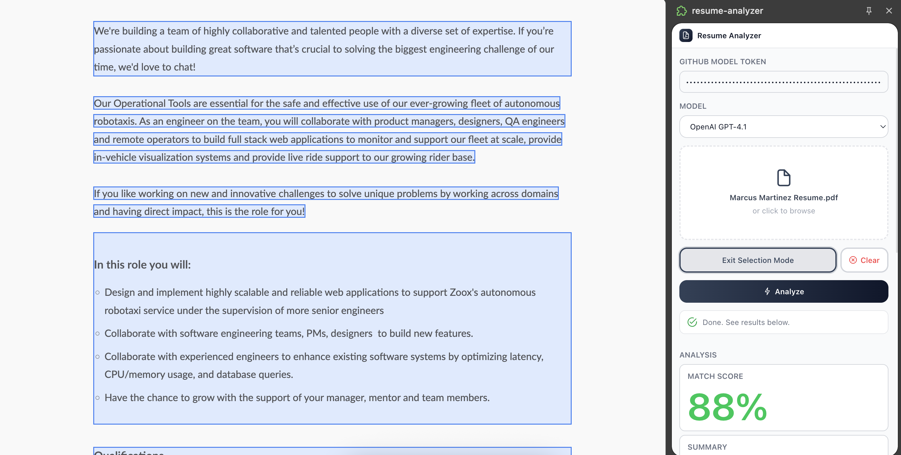
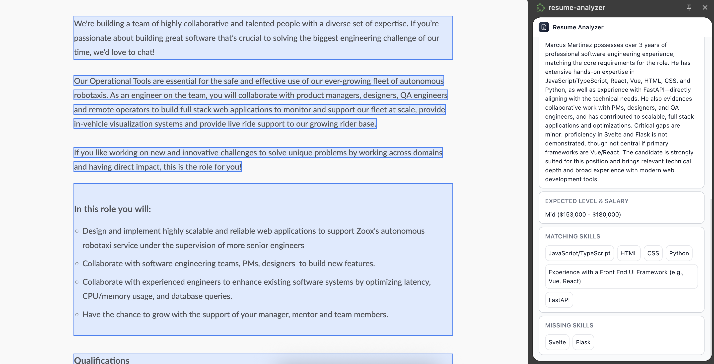

# Resume + Job Description Analyzer Chrome Extension

Paste your token, upload your resume, select the job description, then run an analysis to see how your resume matches up.

This extension runs locally and requires a [GitHub models](https://docs.github.com/en/github-models/use-github-models/prototyping-with-ai-models) token to be generated for private use.




## Stack

- WXT
- Vue3

## Development

```bash
npm install
npm run dev
```

Attach debuggger to Chrome process in VSCode

## Build & Usage

Local

```bash
npm run build
```

1. Go to `chrome://extensions` and enable `Developer Mode`
2. Load unpacked extension from `.output/chrome-mv3/`

Or download from `build` branch and load extension with the above steps.
